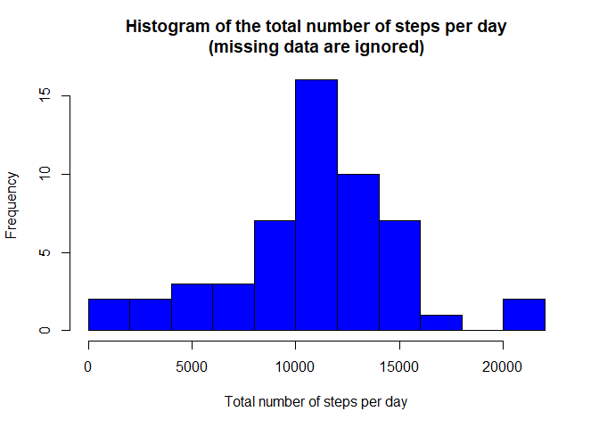
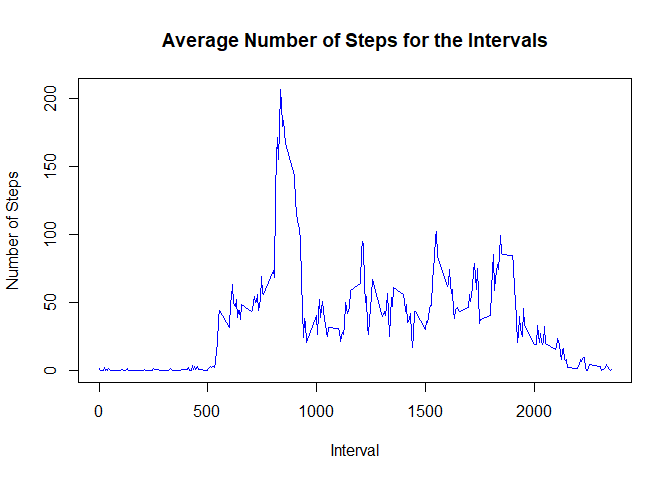
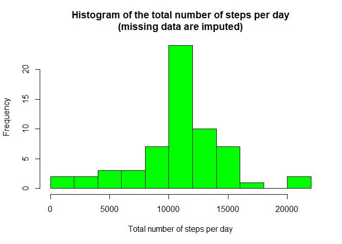
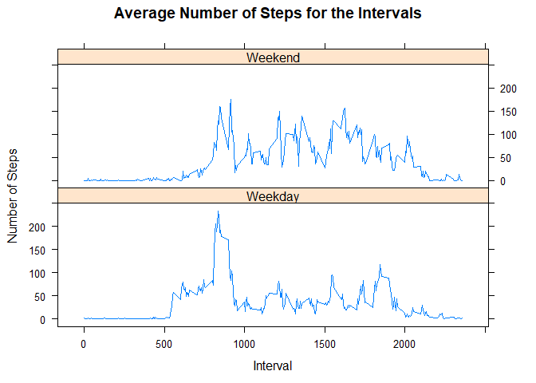

# Reproducible Research: Peer Assessment 1


<center>*by Andrei Ivanov (July, 2017)*</center>

## Introduction

It is now possible to collect a large amount of data about personal movement using activity monitoring devices such as a [Fitbit](http://www.fitbit.com/), [Nike Fuelband](http://www.nike.com/us/en_us/c/nikeplus-fuelband), or [Jawbone Up](https://jawbone.com/up). These type of devices are part of the "quantified self" movement - a group of enthusiasts who take measurements about themselves regularly to improve their health, to find patterns in their behavior, or because they are tech geeks. But these data remain underutilized both because the raw data are hard to obtain and there is a lack of statistical methods and software for processing and interpreting the data.

## Loading and preprocessing the data

The ***DataSetRaw*** is stored in a comma-separated-value (CSV) file:


```r
DataSetFile <- "activity.csv"
```

which should be located in the current working directory. If the file **activity.csv** not downloaded yet, the following code will load the [Activity monitoring data [52K]](https://d396qusza40orc.cloudfront.net/repdata%2Fdata%2Factivity.zip) from the course web site. It will also extracts its contents:


```r
if (!file.exists(DataSetFile)) {
    fileUrl <- "https://d396qusza40orc.cloudfront.net/repdata%2Fdata%2Factivity.zip"
    temp <- tempfile()
    download.file(fileUrl, temp)
    unzip(temp)
    unlink(temp)
}
```

The loading of ***DataSetRaw*** is done by:

```r
DataSetRaw <- read.csv(DataSetFile, stringsAsFactors=F)
```


The variables included in the ***DataSetRaw*** are:

* **steps**: Number of steps taking in a 5-minute interval (missing values are coded as NA)
* **date**: The date on which the measurement was taken in YYYY-MM-DD format
* **interval**: Identifier for the 5-minute interval in which measurement was taken

There are **17568** observations in the ***DataSetRaw***  


Let's remove all observations, which has no data in at least one column:


```r
DataSet <- na.omit(DataSetRaw)
```

As we could see, the ***DataSet*** contains **15264** observations. 


## What is mean total number of steps taken per day?

Following function ***drawHistogram*** will  

* calculate the total number of steps taken each day;
* draw a histogram; 
* return a vector of total number of steps for each day.


```r
library(data.table)

drawHistogram <- function(dataSet, color, actionOnData) {
    # Create a data frame of total steps
    dataFrame <- as.data.frame(data.table(dataSet)[, list(total = sum(steps)), by = c("date")])

    # Plot the histogram
    xlabTxt = "otal number of steps per day"
    hist(dataFrame$total, breaks=10, col=color, 
            main = paste("Histogram of the t", xlabTxt, "\n(missing data are ", actionOnData, ")", sep=""), 
            xlab = paste("T", xlabTxt, sep="")
        )

    dataFrame$total
}
```

The histogram is created by following call of the function ***drawHistogram***:

```r
StepsByDay <- drawHistogram(DataSet, "blue", "ignored")
```

<!-- -->


The **"Mean"** and the **"Median"** values are calculated as 

```r
meanVal <- mean(StepsByDay)
medianVal <- median(StepsByDay)
```

and their values are:

* Mean:     **1.0766189\times 10^{4}** 
* Median:   **10765**


## What is the average daily activity pattern?  

Here is the R-code for  

* calculation of the average number of steps for each interval averaged across all days;
* ploting the Average Number of Steps for each interval;
* determination of the interval with the most average steps.
 

```r
stepsByInterval <- aggregate(steps ~ interval, DataSet, mean)

with (stepsByInterval, plot(interval, steps, type="l", col="blue",
                            xlab="Interval", 
                            ylab="Number of Steps", 
                            main="Average Number of Steps for the Intervals"))
```

<!-- -->

```r
maxAveInterval <- stepsByInterval[which.max(stepsByInterval$steps), ]
```

The interval **835** has the maximum average value of steps: **206.1698113**.


## Imputing missing values

The total number of rows with NA's is **2304** could be defined as:  

```r
sum(is.na(DataSetRaw))
```

Let's construct a new dataset (***DataSetImputed***) by imputing the missing data into ***DataSetRaw***.

Since this task required the use of only a simple calculation method for imputation of missing data, we will use the average value for each interval rounded to the nearest integer.


```r
DataSetImputed <- with (DataSetRaw, 
                        transform(DataSetRaw, 
                             steps = ifelse(is.na(steps), as.integer(stepsByInterval$steps + 0.5), steps)))
```

Let's construct a hystogram for ***DataSetImputed*** by calling previously created function ***drawHistogram***:

```r
StepsByDayImp <- drawHistogram(DataSetImputed, "green", "imputed")
```

<!-- -->


... and compute **"Mean"** and the **"Median"** values for ***StepsByDayImp***:

```r
meanValImputed <- mean(StepsByDayImp)
medianValImputed <- median(StepsByDayImp)
```

As we could see, the values of **"Mean"** and **"Median"** did not change much:  

* Mean:     **1.0765639\times 10^{4}** vs. **1.0766189\times 10^{4}**. The change is only **0.0051024%**.
* Median:   **10762** vs. **10765** The change is only **0.0278681%**.


## Are there differences in activity patterns between weekdays and weekends?

To investigate the differences in activity patterns between weekdays and weekends, we will create a new factor variable ***dayType*** in the ***DataSet***


```r
dayType <- function(date) {
    ifelse (weekdays(date) %in% c("Saturday", "Sunday"), "Weekend", "Weekday")
}

DataSet$dayType <- sapply(as.Date(DataSet$date), FUN = dayType)
```

Let's make a panel plot containing a time series plot of the 5-minute interval (x-axis) and the average number of steps taken, averaged across all weekday days or weekend days (y-axis).


```r
stepsByInterval <- aggregate(steps ~ interval + dayType, DataSet, mean)

library(lattice)

with (stepsByInterval, 
      xyplot(steps ~ interval | dayType, layout=c(1,2), type="l",
            main = "Average Number of Steps for the Intervals", 
            xlab = "Interval", 
            ylab = "Number of Steps")
     )
```

<!-- -->
